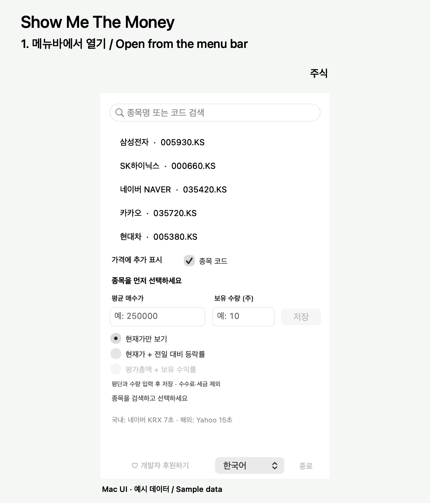

# Show Me The Money

맥 메뉴바·윈도우 작업표시줄에서 주가를 확인하는 가벼운 무료 앱.
A free, lightweight stock ticker for the macOS menu bar and Windows taskbar.

[](https://github.com/dlgudrms/showmethemoney/releases "All release downloads / 전체 릴리스 다운로드 횟수")

작업하다가 주가 하나만 슬쩍 보고 싶어서 만들었습니다.
Mac은 상단 메뉴바에, Windows는 작업표시줄 위 작은 창에 가격을 띄워줍니다. 무료입니다.

[다운로드](https://github.com/dlgudrms/showmethemoney/releases/tag/v1.0.1) · [소개 페이지](https://dlgudrms.github.io/showmethemoney/) · [커피 한 잔 사주기](https://buymeacoffee.com/hglee)



Mac 앱 UI로 만든 10초 사용 예시입니다. 가격은 예시 데이터입니다.
10-second demo rendered with the Mac app UI. Prices are sample data.

## 사용하기

압축을 풀고 앱을 실행한 뒤, 종목을 검색해서 고르면 됩니다.
`삼성전자`, `AAPL`, `005930`, `086520`처럼 이름이나 코드로 검색할 수 있습니다.

- 가격만 볼 수도 있고, 종목 코드를 같이 표시할 수도 있습니다.
- 평단과 수량을 넣으면 평가금액과 수익률로 바꿔 볼 수 있습니다.
- 한국어에서는 원화(₩), 영어에서는 달러($)로 환산해서 보여줍니다.
- 평단 입력은 해당 종목의 거래 통화 기준입니다. 입력란에서 통화를 확인하세요.

Mac은 macOS 13 이상에서 Intel·Apple Silicon 모두 사용할 수 있습니다.
Windows는 PC에 맞는 x64 또는 ARM64 파일을 받으세요. [.NET 10 Desktop Runtime](https://dotnet.microsoft.com/en-us/download/dotnet/10.0)이 필요합니다.

국내 시세는 네이버 KRX, 해외 시세는 Yahoo를 사용합니다. 장중에는 각각 7초·15초마다 확인하고, 장 종료 시에는 간격을 늘립니다. 시세가 지연될 수 있으며, 수익률에는 수수료와 세금이 포함되지 않습니다.

환산에는 Frankfurter의 일별 기준 환율을 사용하며, 한 시간 동안 캐시합니다. 시세 출처·시간과 환율 기준 날짜를 함께 표시합니다. 마지막 환율은 재시작 후에도 남아 있으며, 새로 확인하지 못한 환율에는 이전 환율 표시가 붙습니다. 수익률은 환차손익을 제외한 주가 변동 기준입니다.

## 직접 빌드하기

Mac은 Swift/AppKit, Windows는 C#/WinForms로 만들었습니다.

```sh
# Mac — Xcode Command Line Tools 필요
bash macos/build.sh
```

```powershell
# Windows — .NET 10 SDK 필요
dotnet publish windows/ShowMeTheMoney.csproj -c Release -r win-x64 --self-contained false -o dist/windows
```

소개 페이지는 `docs/`, 이전 Electron 초안은 `archive/electron-prototype/`에 있습니다.
불편한 점이나 버그는 [Issues](https://github.com/dlgudrms/showmethemoney/issues)에 남겨주세요.


## English

I made this to keep an eye on one stock while working.
It shows the price in the Mac menu bar or a small window above the Windows taskbar. It's free.

[Download 1.0.1](https://github.com/dlgudrms/showmethemoney/releases/tag/v1.0.1) · [Website](https://dlgudrms.github.io/showmethemoney/) · [Buy me a coffee](https://buymeacoffee.com/hglee)

Unzip, launch, search for a stock, and select it. Try `AAPL`, `Samsung`, or a Korean stock code such as `005930`.

- Show just the price, or include the stock symbol.
- Enter your average cost and shares to see holding value and return.
- Korean displays KRW (₩); English displays USD ($).
- Enter average cost in the stock's trading currency, shown beside the input.

Mac requires macOS 13 or later and supports Intel and Apple Silicon.
On Windows, choose x64 or ARM64 and install the matching [.NET 10 Desktop Runtime](https://dotnet.microsoft.com/en-us/download/dotnet/10.0).

Korean quotes come from Naver KRX; overseas quotes come from Yahoo. Quotes may be delayed. Currency conversion uses Frankfurter daily reference rates, cached for one hour. The last successful rates are saved across restarts and labeled as cached until refreshed. Quote details and the FX date appear together. Returns reflect stock price changes and exclude FX gains, fees, and taxes.

To build from source, use the commands above. The Mac app uses Swift/AppKit; Windows uses C#/WinForms. Found a bug? [Open an issue](https://github.com/dlgudrms/showmethemoney/issues).
